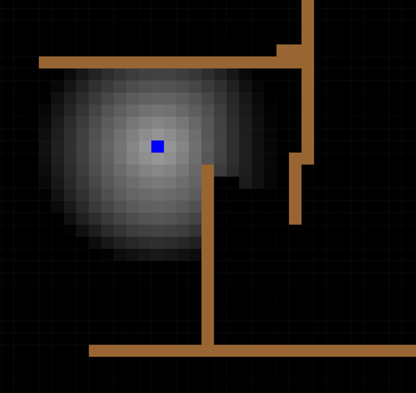

# ZombieWalk
Chase game for iPad using Swift and Quartz

Just the beginnings of a chase game.\
The intent is that a swarm of slow moving zombies will chase you around an uneven terrain.

So far:
1. the uneven terrain is created (darker regions are harder/slower to cross)
2. a single zombie determines the easiest path from starting point to destination.
3. a slider allows you to smooth the uneven terrain.
4. click on screen to move the start point or endpoint to new position.

next steps:
5. add the human player, controlled by movement widgets (or maybe tilt)
6. more zombies,  who update their path as necessary..

